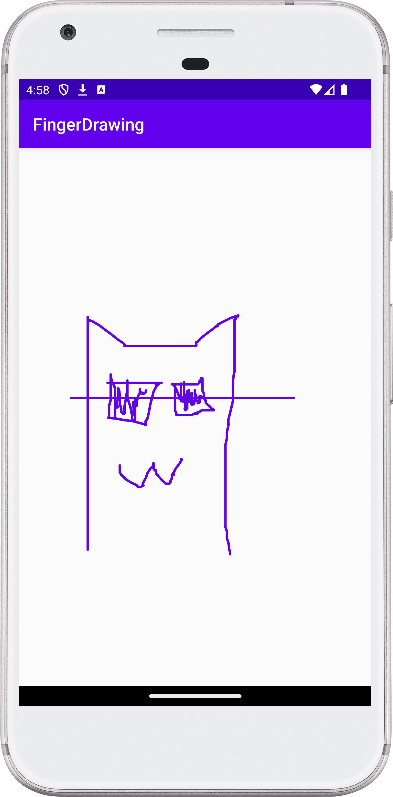

[](https://stand-with-ukraine.pp.ua)


# Finger Drawing Sample

This sample demonstrates how to create a custom View that allows the user to
draw on the screen with their finger.

## Value:

This project provides a clear and concise example of:

- Creating a custom View by extending the View class.
- Handling touch events to capture user input.
- Using Canvas and Paint to draw on the screen.
- Creating a simple drawing application.
  This sample can be used as a starting point for creating more complex custom
  Views or for learning about touch event handling and drawing in Android.

## Implementation Details:

The SignatureView class is a custom View that extends the View class. It uses
a Paint object to define the color and style of the drawing and a Path object
to store the user's drawing path.

The onTouchEvent() method is overridden to handle touch events. When the user
touches the screen (ACTION_DOWN), the starting point of the path is set. As
the user moves their finger (ACTION_MOVE), the path is updated and the view is
invalidated to redraw the screen.

The onDraw() method is overridden to draw the path on the Canvas using the
Paint object.

## Usage:

To use the SignatureView, simply add it to your layout XML file:

```xml

<view class="ua.turskyi.fingerdrawing.CanvasActivity$SignatureView"
    android:layout_width="match_parent" android:layout_height="match_parent" />
```

This will create a full-screen drawing area where the user can draw with their
finger.

## Screenshot:

<!--suppress CheckImageSize -->


## Contact:

For any inquiries or suggestions, please open an issue on the GitHub repository
or reach out to me directly at
[dmytro@turskyi.com](mailto:dmytro@turskyi.com).